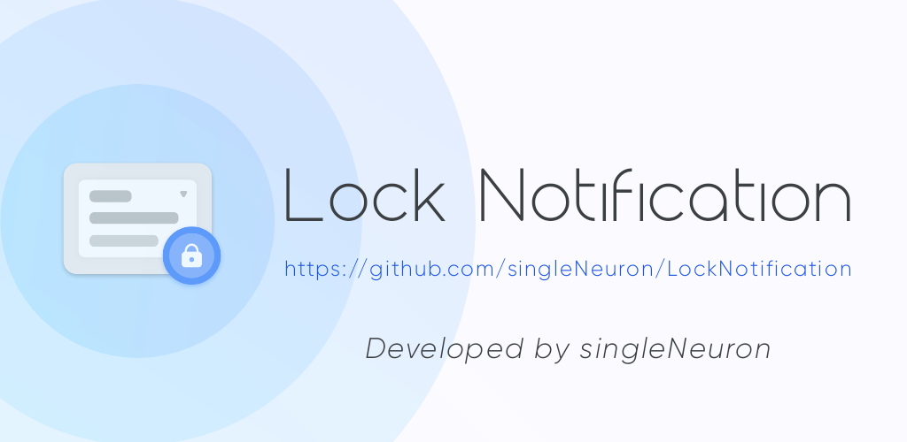
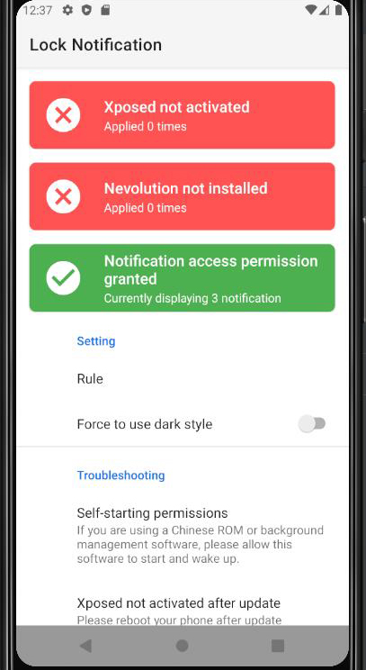
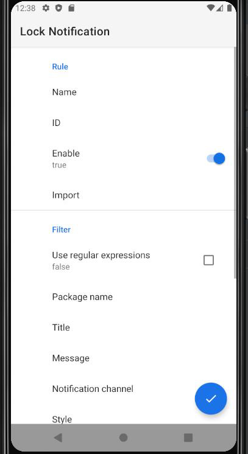

# LockNotification

An xposed/nevolution module to improve notifications  
Such as: Lock a notification to prevent it from being cleared  
         Throw it in another channel in order to set a different importance or sound  
         Make it invisible on lockscreen

Thanks Lagrio a lot for drawing icon  
Telegram: https://t.me/NeuronDevelopChannel  
QQ Group: 951343825  

  

Example: https://github.com/singleNeuron/LockNotification/wiki/Example

